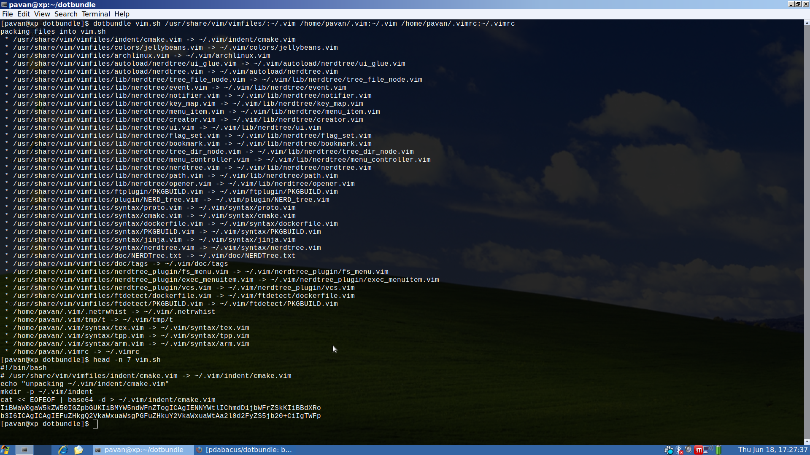

# dotbundle
bundle your files into an executable which unpacks them to the new location

basically its the same as using zip, but you say the paths where things unzip

## motivation
* i want to copy and paste multiple files between machines with my clipboard all at once
* when i ssh into master nodes in kubernettes, i randomly get one of the nodes and i dont want to keep trying sftp until i get the right one :/

## help
```
usage: dotbundle <bundle file> <in>:<out> [<in2>:<out2> ...] [<indir>:<outdir>]

bundle your files into an executable which unpacks them to the new location
(useful for making a bundle of dotfiles to quickly deploy to another machine)

all ascii text, so clipboard copy paste friendly

example:
dotbundle bundle.sh \
    ~/.vimrc:~/.vimrc \
    /usr/share/vim/vimfiles/colors/:~/.vim/colors/ \
    ~/.bashrc
```

## creating the bundle:
```
dotbundle vim.sh /usr/share/vim/vimfiles/:~/.vim ~/.vim:~/.vim ~/.vimrc:~/.vimrc
```


## using the bundle:
```
./vim.sh
```


or alternatively, just copy the contents of the bundle to your clipboard and paste it in terminal on the other machine

a.sh:
```
#!/bin/bash
# a/txt1 -> a/txt1
echo "unpacking a/txt1"
mkdir -p a
cat << EOFEOF | base64 -d > a/txt1
YWFhYQo=
EOFEOF

# a/b/txt3 -> a/b/txt3
echo "unpacking a/b/txt3"
mkdir -p a/b
cat << EOFEOF | base64 -d > a/b/txt3
Y2NjYwo=
EOFEOF

# a/txt2 -> a/txt2
echo "unpacking a/txt2"
mkdir -p a
cat << EOFEOF | base64 -d > a/txt2
YmJiYgo=
EOFEOF
```

